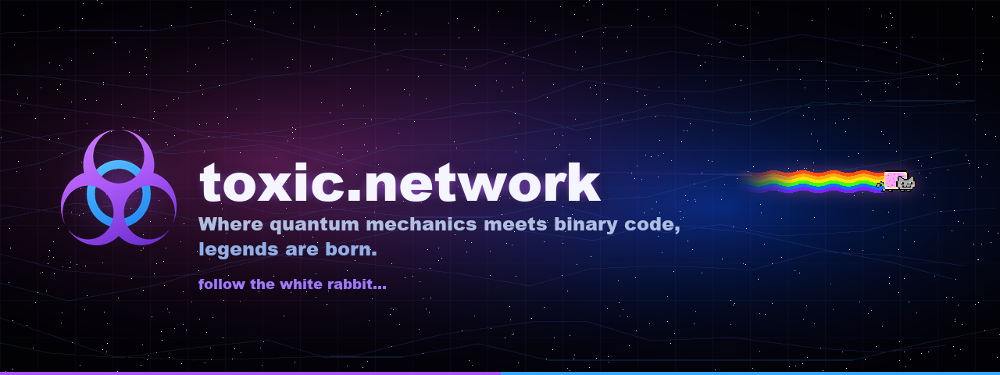

  

  <strong><a href="https://toxic.network">toxic.network</a></strong> 
  Where quantum mechanics meets binary code, legends are born.

---

A small cyber landing page — dark void, connecting wires, one flying cat, and a macOS-style About window.

### What's inside

- Flying Nyan Cat across a wire-grid void  
- Liquid-glass Finder window with profile, GitHub, Signal, and projects  
- Dock navigation at the bottom of the screen  
- Purple / blue toxic branding throughout  

### Links

- Site → [toxic.network](https://toxic.network)  
- GitHub → [ksg23](https://github.com/ksg23)  
- Project → [QFS Collectibles](https://qfscollect.com)  

---

<em>Follow the white rabbit…</em>

